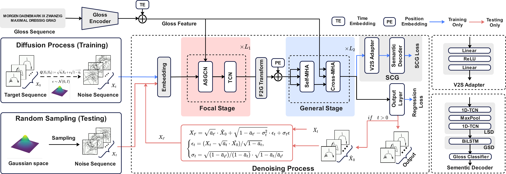

<div align="center">

# FGDM

**Focal–General Diffusion Model with Semantic Consistent Guidance for Sign Language Production**

Yiheng Yu · Sheng Liu · Yuan Feng · Zhelun Jin · Yining Jiang · Min Xu

Zhejiang University of Technology

**CVPR 2026**

[](LICENSE.md)
[](https://yuyiheng-eu.github.io/fgdm/)

<p align="center">
  
</p>

</div>

---

## Abstract

We propose FGDM, a two-stage diffusion model for Gloss-to-Pose Sign Language Production. The Focal stage leverages an Adaptive Sign Graph Convolutional Network (ASGCN) to capture fine-grained joint-level dependencies, while the General stage employs a Transformer to model global sequence coherence. A Semantic Consistent Guidance (SCG) module provides cross-modal supervision via CTC-based alignment.

---

## Prerequisites

```bash
conda create -n env_slp python=3.10
conda activate env_slp
pip install -r requirements.txt
```

> PyTorch with CUDA 11.8 is required. See `requirements.txt` for details.

---

## Data Preparation

### PHOENIX-2014T

**Option A — Download preprocessed data** (recommended)

Download from [Google Drive](https://drive.google.com/file/d/1vv_guqav7Rz5fAsZIB-S2VdKAtWiBb_q/view?usp=drive_link) and extract to `./Data`.

**Option B — Process from scratch**

**Step 1.** Generate annotation files:

```bash
cd preprocess/PHOENIX14T
python process_phoenix14t.py
```

**Step 2.** Install [OpenPose](https://github.com/CMU-Perceptual-Computing-Lab/openpose):

```bash
git clone https://github.com/CMU-Perceptual-Computing-Lab/openpose
cd openpose && git submodule update --init --recursive --remote
mkdir build && cd build && cmake .. && make -j`nproc`
```

Verify installation: `openpose/build/examples/openpose/openpose.bin` should exist.

<details>
<summary>Troubleshooting: model download mirrors</summary>

- Models: https://drive.google.com/file/d/1QCSxJZpnWvM00hx49CJ2zky7PWGzpcEh
- 3rdparty (before 2021): https://drive.google.com/file/d/1mqPEnqCk5bLMZ3XnfvxA4Dao7pj0TErr
- 3rdparty (2021+): https://drive.google.com/file/d/1WvftDLLEwAxeO2A-n12g5IFtfLbMY9mG
</details>

**Step 3.** Extract 2D keypoints:

```bash
cd preprocess/PHOENIX14T
python get2dkeypoints.py
```

Each frame extracts 50 keypoints (8 body + 21 left hand + 21 right hand), each with `(x, y, confidence)`. The `.skels` file stores `151 × n` values per video (150 coordinates + 1 frame index).

**Step 4.** Lift to 3D coordinates using [Prompt2Sign/tools/2D_to_3D](https://github.com/SignLLM/Prompt2Sign/tree/main/tools/2D_to_3D).

### USTC-CSL

Requires application at [CSL Dataset](https://ustc-slr.github.io/datasets/2015_csl/). Not yet supported.

---

## Training

```bash
sh slp_train.sh
# Equivalent to: python __main__.py train ./Configs/FGDM.yaml
```

## Testing

```bash
sh slp_test.sh
# Equivalent to: python __main__.py test ./Configs/FGDM.yaml
```

## Back-Translation Evaluation

Evaluate generated poses via sign language back-translation.

**Download SLT data and checkpoints** (required for back-translation):

Download from [Baidu Drive](https://pan.baidu.com/s/1x_SDXYPHwTzlEJwrKlHr3A?pwd=xhys) (pwd: `xhys`) and extract to `SLT-main/`. The directory should look like:

> This data is provided by [Sign-IDD](https://github.com/NaVi-start/Sign-IDD).

```
SLT-main/
├── Ground Truth/          # Ground truth skeleton data (dev & test)
├── PHOENIX2014T/          # PHOENIX dataset for SLT
├── sign_skels_model/      # Pre-trained SLT checkpoint
│   └── best.ckpt
├── signjoey/              # SLT source code (included in repo)
└── configs/
```

**Run evaluation:**

```bash
sh slt_test.sh [GPU_ID] [CHECKPOINT]
# Example: sh slt_test.sh 0 SLT-main/sign_skels_model/best.ckpt
```

---

## Project Structure

```
FGDM/
├── __main__.py               # Entry point
├── model.py                  # FGDM model definition
├── training.py               # Training loop
├── module/
│   ├── Diffusion.py          # DDPM diffusion process
│   ├── Denoiser.py           # Focal + General denoiser
│   ├── encoder.py            # Gloss encoder (Transformer)
│   ├── gcn.py                # ASGCN (Adaptive Sign GCN)
│   ├── scg_network.py        # Semantic Consistent Guidance
│   └── ...
├── Configs/
│   └── FGDM.yaml             # Main configuration
├── SLT-main/                 # Back-translation model
└── preprocess/               # Data preprocessing scripts
```

---

## Citation

If you find this work useful, please cite:

```bibtex
@inproceedings{yu2026fgdm,
  title={Focal–General Diffusion Model with Semantic Consistent Guidance for Sign Language Production},
  author={Yu, Yiheng and Liu, Sheng and Feng, Yuan and Jin, Zhelun and Jiang, Yining and Xu, Min},
  booktitle={IEEE Conference on Computer Vision and Pattern Recognition (CVPR)},
  year={2026}
}
```

---

## Acknowledgements

We thank the authors of [Progressive Transformer](https://github.com/BenSaunders27/ProgressiveTransformersSLP), [Sign-IDD](https://github.com/NaVi-start/Sign-IDD), [D3DP](https://github.com/paTRICK-swk/D3DP), and [Joey NMT](https://github.com/joeynmt/joeynmt) for their open-source contributions.

---

## License

This project is licensed under the [MIT License](LICENSE.md).
